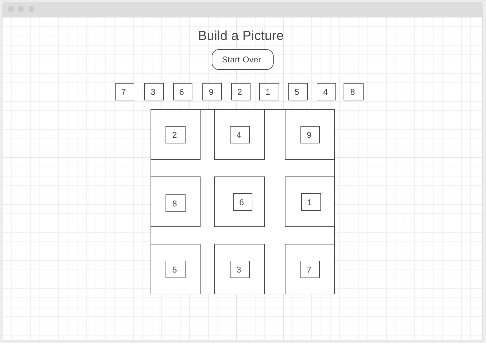

//On open, a user will see the title of the game, a 'start over' button, instructions to play, a line of nine buttons (each represented by a number 1 - 9), and a blank canvas or board.

//The only buttons at the start of the game that will work are the 'start over' button, and the button represented by the number 1

//Pressing the 'start over' button will reorder the nine buttons in another random sequence

//Pressing the button represented by the number 1 will display a square with a portion of an image in the board area.

//The only buttons that will work at this point are the 'start over' button and the button represented by the number 2.

//The player will continue clicking the numbered buttons in the ascending order.

//Each time a correct button is clicked, another image (or piece of the puzzle) will appear on the board.

//The board is broken down by a 3x3 grid of squares where each square is controlled by the numbered buttons.

//To add some intrigue, the squares will not appear in sequential order, but rather will be placed all over the board.  This will also provide a more puzzle-like feeling for the user.

//Once all squares have been revealed, a single image will be displayed.

//A "You Won!" message will also appear at the bottom.

/*----- constants -----*/ 

/*----- app's state (variables) -----*/ 

/*----- cached element references -----*/ 

/*----- event listeners -----*/ 

/*----- functions -----*/
